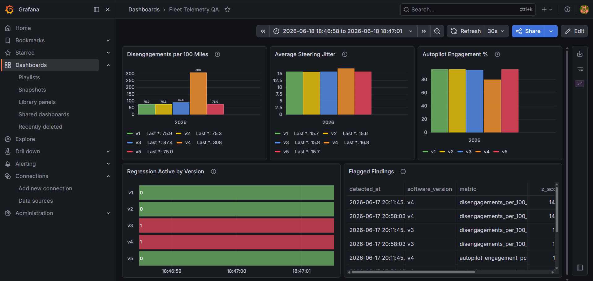
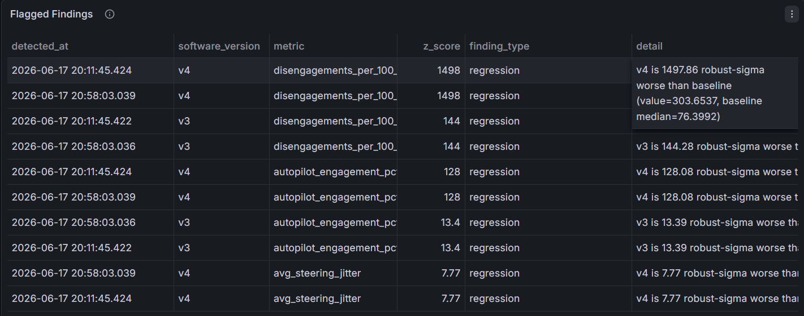

# FleetTelemetryQA

> Autonomous-vehicle telemetry pipeline with statistical regression detection, a live Grafana dashboard, and an LLM triage layer powered by Claude.

<!-- ============================================================
  SCREENSHOT #1 — Grafana dashboard
  Take a full-browser screenshot of http://localhost:3000 with
  all 5 panels visible and v4 clearly spiking in the bar charts.
  Save it as docs/grafana_dashboard.png and replace the line below.
  ============================================================ -->


---

## What this demonstrates

- **Anomaly detection with robust statistics** — median/MAD instead of mean/stdev so a single bad baseline version can't blow up the spread
- **PELT changepoint detection** — catches instability *inside* a version, independent of the cross-version z-score check
- **Containerized observability stack** — Postgres → Prometheus → Grafana, fully provisioned, zero manual setup
- **LLM as a triage layer** — Claude reads the statistical findings and writes a plain-English incident report; it does not detect anything
- **End-to-end pipeline** — raw telemetry rows → statistical findings → human-readable report, all reproducible with `make`

---

## Architecture

```
generate_telemetry.py
        |
        v
  Postgres (fleetdb)
     telemetry table
        |
        +---> detect_regressions.py ---> findings table ---> triage.py (LLM summary)
        |
        +---> metrics_service/metrics.py
                        |
                        v
                  Prometheus :9090
                        |
                        v
                   Grafana :3000
```

`generate_telemetry.py` runs once to populate `telemetry`. `detect_regressions.py` reads
aggregate metrics from `telemetry`, runs the statistical checks, and writes results to
`findings`. The metrics service is a separate long-running process that re-reads Postgres
every 15 seconds and exposes Prometheus gauges, including a `fleet_regression_flagged`
gauge that lights up once detection has run.

---

## Live triage output

Below is real output from `triage.py` after running detection against the populated database.

```
======================================================================
FLEET TELEMETRY QA — LLM TRIAGE REPORT
Model: claude-opus-4-8  |  Detection: statistical (not LLM)
======================================================================

## Triage Note — AV Fleet Telemetry Regression Review

**Data hygiene flag first:** The detector emitted each finding twice (1≡2, 3≡4, 5≡6,
7≡8, 9≡10). There are **5 unique findings**, not 10. Recommend deduplicating at the
query/detector layer before these reach the QA queue — duplicate rows inflate alert
volume and skew any downstream severity counts.

Also note: the extreme z-scores are partly an artifact of very small baseline MAD values
(~0.05–0.10). When baseline variance is near zero, even modest absolute shifts produce
enormous robust-sigma counts. **Use z-score for ranking, but judge real-world impact
from the absolute deltas.**

---

### Ranked Findings (deduplicated)

**1. v4 — Disengagements per 100 miles (most severe)**
- *Plain English:* The car is handing control back to the safety driver roughly four
  times as often as the known-good baseline. This is a major safety-relevant autonomy
  degradation, not a metric blip.
- *Root-cause hypothesis:* A core perception or planning regression in v4 — likely a
  model/policy change that fails more frequently in nominal conditions, forcing fallback.
  Prime suspect for a release-blocking bug.

**2. v4 — Autopilot engagement %**
- *Plain English:* Autonomy is staying engaged ~15 points less of the time than baseline;
  the system is either refusing to engage or self-disabling.
- *Root-cause hypothesis:* Strongly correlated with Finding #1 — the same fault is
  tripping disengagements, which mechanically suppresses engagement uptime. Likely one
  root cause, two symptoms.

**3. v3 — Disengagements per 100 miles**
- *Plain English:* v3 also regresses on disengagements, but mildly (~14% above baseline)
  compared to v4's blowup.
- *Root-cause hypothesis:* An earlier, smaller version of the same defect class —
  possibly the seed regression that v4 amplified. Worth diffing v3→v4 changes on the
  autonomy stack.

**4. v3 — Autopilot engagement %**
- *Plain English:* A small but statistically clear dip in engagement uptime (~0.8
  points). Real but operationally minor.
- *Root-cause hypothesis:* Secondary effect of the v3 disengagement increase; low
  priority on its own.

**5. v4 — Average steering jitter (least severe)**
- *Plain English:* Lateral control is measurably less smooth in v4, but the absolute
  increase is small.
- *Root-cause hypothesis:* Possibly a side effect of the v4 planner/controller change
  driving the disengagement regression — degraded control quality near failure boundaries.
  Treat as a corroborating signal, not an independent issue.

---

### Overall Triage Summary

**v4 is the problem release.** It owns the three highest-severity findings and shows a
coherent failure signature: a large disengagement spike, a corresponding collapse in
engagement uptime, and degraded steering smoothness. These almost certainly trace to a
**single root cause in the v4 autonomy stack** (perception/planning/controller) rather
than three independent bugs.

**v3 shows an early, mild version of the same disengagement regression** — suggesting
the defect was introduced or partially present in v3 and got substantially worse in v4.
Recommend prioritizing a code/model diff between baseline → v3 → v4 on the autonomy
pipeline.

**Recommended actions:**
1. Block v4 promotion; treat the disengagement regression as P0.
2. Investigate v3→v4 changes as the likely amplifier.
3. Fix the duplicate-emission bug in the detector before the next review cycle.

======================================================================
END OF TRIAGE REPORT
NOTE: Findings were detected statistically. This report is an LLM
      summary only — it does not affect detection or scoring.
======================================================================
```

---

## Per-version metrics (real data, 7.7M rows)

v4 is the planted regression. Everything else is baseline.

| Version | Rows      | Disengage rate | Avg steering jitter | Autopilot % |
|---------|-----------|----------------|---------------------|-------------|
| v1      | 1,708,000 | 0.0010         | 15.693              | 95.1%       |
| v2      | 1,500,000 | 0.0010         | 15.720              | 95.1%       |
| v3      | 1,500,000 | 0.0011         | 15.775              | 94.4%       |
| v4      | 1,500,000 | 0.0040         | 16.844              | 79.9%       |
| v5      | 1,500,000 | 0.0010         | 15.653              | 95.1%       |

v4 disengages four times as often as the baseline, has noticeably higher steering jitter,
and drops autopilot engagement from ~95% to 79.9%.

---

## Key design decisions

**Why median and MAD instead of mean and standard deviation?**
If one baseline version is already degraded, the mean shifts and the standard deviation
inflates — making subsequent regressions harder to catch. Median and MAD are resistant to
that contamination. One bad point cannot blow up the spread.

**Why two independent detectors?**
The z-score check compares versions against each other (cross-version signal). PELT looks
for abrupt shifts inside a single version (intra-version signal). They are mathematically
independent, so when both flag v4 the finding is far more credible than if only one did.

**Why is the LLM a summarizer and not a detector?**
Statistical methods are deterministic, auditable, and cheap to run. An LLM is none of
those things. Detection lives in `detect_regressions.py`; the LLM in `triage.py` only
translates the numbers into plain English for a human reviewer. The findings table is the
ground truth — the LLM output does not write to it or influence it.

---

## Running the project

**Prerequisites:** Docker with Compose, Python 3.11+, an Anthropic API key (for triage only).

```bash
# 1. Start Postgres, the metrics exporter, Prometheus, and Grafana
make up

# 2. Install Python dependencies
pip install -r requirements.txt

# 3. Generate telemetry (~7.7M rows, takes a few minutes)
make generate

# 4. Run statistical detection and write findings to Postgres
make detect

# 5. Open Grafana at http://localhost:3000  (admin / admin)

# 6. (Optional) Run LLM triage
cp .env.example .env        # then paste your Anthropic API key into .env
make triage
```

**Make targets**

| Target          | What it does                              |
|-----------------|-------------------------------------------|
| `make up`       | `docker compose up -d`                    |
| `make down`     | `docker compose down`                     |
| `make generate` | populate the telemetry table              |
| `make detect`   | run statistical detection, write findings |
| `make triage`   | LLM triage report (requires `.env`)       |
| `make test`     | `pytest test_detection.py -v`             |

**Service URLs**

| Service    | URL                           |
|------------|-------------------------------|
| Grafana    | http://localhost:3000         |
| Prometheus | http://localhost:9090         |
| Metrics    | http://localhost:8000/metrics |

---

## Flagged findings (Grafana panel)

<!-- ============================================================
  SCREENSHOT #2 — Flagged Findings panel
  Zoom into just the bottom-right table panel in Grafana that shows
  the findings table sorted by z-score. Save as docs/findings_panel.png.
  ============================================================ -->


---

## Limitations and next steps

- The planted regression in v4 is large enough to be obvious. A subtler regression
  (disengage_prob of 0.0015 instead of 0.005) would require more data or a tighter
  baseline to catch reliably.
- The PELT penalty (0.5) was chosen by inspection. It works here but would need tuning
  for noisier real-world signals.
- Five software versions is too few for a statistically stable baseline. With only two or
  three prior points the robust z-score is sensitive to the exact spread of those points.
- The metrics service has no retry logic. If Postgres is slow to start, the container
  crashes. A health check in `docker-compose.yml` would fix this.
- No alerts are wired up yet. `fleet_regression_flagged` is queryable in Grafana but does
  not page anyone.
